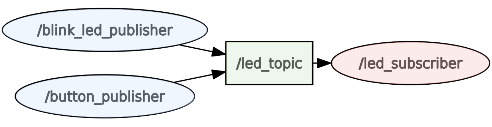
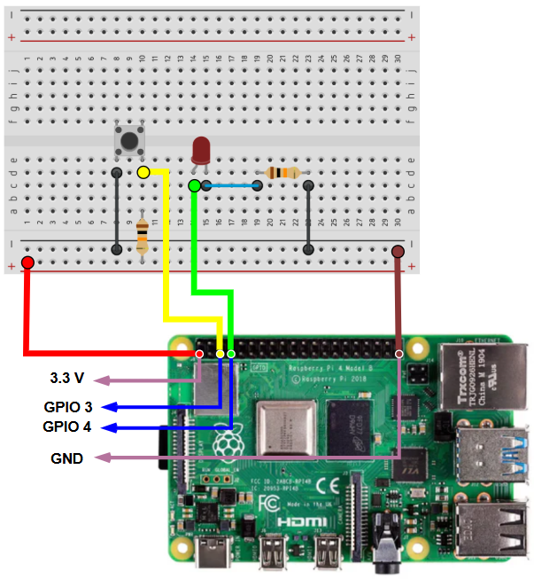

# ROS2 Laboratory 2 - The Basics Part 2

In Lab 1 we met Jerry and learned the ROS 2 basics (nodes, topics, services). While these functionalities are simple, we made some big assumptions: a pre-build environment, pre-made nodes and setup files. In this second lab we'll play around with the same ideas (nodes, topics, services) but this time we will build them from scratch. We will also talk about configurable parameters and launch files.

We will explain all these concepts in the first part of the lab where we will work with a simple 2D rover called Luna. In the second part of this lab, we will use the concepts that we have learned (publishers-subscribers, parameters, launch files etc.) to make a make an LED blink periodically.

## Meet Luna

Our tiny hero this time is **Luna**, a 2D rover that listens to velocity commands and periodically reports a simple pose. This time we'll implement two nodes:

- **LunaCommander** – publishes `cmd_vel` commands
- **LunaDriver** – listens to `cmd_vel`, "moves" Luna, and publishes a `pose`

---

### Setting up the project workspace

The first thing to do when starting a new project with ROS is creating a _workspace_. A ROS 2 _workspace_ is a folder where you keep your packages and build outputs. Standard layout:

- `src/` — your source packages
- `build/` — intermediate build artifacts (autogenerated)
- `install/` — the installed result (what you actually _source_)
- `log/` — logs from builds/runs

`colcon build` compiles/installs everything under `src/` into `install/`. **Sourcing** (`source install/setup.bash`) overlays environment variables so the shell can find your packages, launch files, and executables. Re‑source after every build.

We will start by creating a directory for our project with a _src_ folder inside. Let's call it _luna_workspace_. After creating and navigate to the workspace directory we must build and source. This will automatically create the rest of the structure. On a terminal we can run:

```bash
mkdir -p luna_workspace/src
cd luna_workspace
colcon build
source install/setup.bash
```

> **Imporant**: Don't forget ROS good practices! We must re-source after every build.

---

### Creating a package

Since we have created our workspace environment, it's time to make a package for our nodes. A ROS package is the smallest shareable unit in ROS2 — code + metadata. For Python packages we use the **`ament_python`** build type. Creating a package gives you:

- `package.xml` — package _metadata_ and dependencies (build/run/test)
- `setup.py` — Python packaging entry point (tells ROS 2 how to install and expose executables)
- `setup.cfg` — helper config for setuptools/entry points
- `resource/<pkg>` — a marker used by the ament index to discover the package
- `<pkg>/` — the Python module where your node code lives (e.g., `luna_package/`)

When creating a new package we must declare what dependencies we are going to need. This could be standard ROS messages or services for example. This is important so that tools (and other developers) know which message libs and runtime APIs you require (e.g., `rclpy`, `geometry_msgs`). `ros2 pkg create` writes them into `package.xml` for you.

We’ll create one **ament_python** package that contains both nodes and (later) a launch file and a YAML config.

```bash
cd luna_workspace/src
ros2 pkg create luna_package \
  --build-type ament_python \
  --dependencies rclpy geometry_msgs
```

This generates the standard files: `package.xml`, `setup.py`, `setup.cfg`, a Python package folder, etc.

---

### Making configurable nodes

As we saw in the previous lab, a node is a single running process that communicates via topics, services, and parameters. In Python we subclass `rclpy.node.Node` to create publishers/subscribers and timers. In this lab:

- **LunaCommander** publishes `geometry_msgs/Twist` commands at a fixed period in the `cmd_vel` topic
- **LunaDriver** subscribes to `cmd_vel`, integrates a tiny unicycle model, and publishes a `geometry_msgs/Pose2D`

We will use pre-build messages from the `geometry_msgs` package. `Twist` carries linear and angular velocity. `Pose2D` will keep this lab simple; on real robots you’d often use `nav_msgs/Odometry` or TF transforms. Let's check out the structure of the messages as we learned in the previous lab:

```bash
ros2 interface show geometry_msgs/msg/Twist
ros2 interface show geometry_msgs/msg/Pose2D
```

This time will set some configurable paramters in this node. Parameters are key–value pairs owned by a node. You **declare** them (with a default) and then **get**/**set** them at runtime via CLI, YAML, or launch. Some parameters are read once on startup; others you might re-read periodically or handle via a parameter callback for truly dynamic updates.

**Why do we need parameters?**

The main idea behind parameters is in being able to quicly change some variables that we want without having to modify the source code. In a project that must be ran by many different people this is a necessity. We need an easy and strightforward way to show which parts of our project are configurable. When using pure Python this can be harder to understand, but for users of compiled languages (like C++) recompiling everything just to change a variable is something to be avoided.

#### **LunaCommander** – publishes `geometry_msgs/Twist`

Okay so let's create our first node! We will create the Python files inside `luna_package/luna_package/`:

```bash
cd luna_workspace/src
touch luna_package/luna_package/luna_commander_node.py
```

We want this node to create a publisher on a configurable topic (default `cmd_vel`) and send randomized velocity commands on a timer. Linear and angular velocities as well as the timer period are parameters so we can experiment with them at runtime. The timer’s interval is read at creation; if you change it later, you’d recreate the timer.

> **Important**: Whether a parameter is a one-off or continuously read parameter is irrelevant when declaring it and we must set an initial value for it. We do that with the `self.declare_parameter` command.

`luna_workspace/src/luna_package/luna_package/luna_commander_node.py`

```python
import random
import rclpy
from rclpy.node import Node
from geometry_msgs.msg import Twist


class LunaCommanderNode(Node):
    # Publishes velocity commands to move Luna around.

    def __init__(self) -> None:
        super().__init__('luna_commander')

        # One-off parameters
        self.declare_parameter('topic_name', 'cmd_vel')
        topic_name = self.get_parameter('topic_name').value

        # Continuously read parameters (can change them at runtime)
        ### ENTER CODE #########


        ########################
        # Timer uses the current value of period only at creation time
        ### ENTER CODE #########


        ########################

    def timer_callback(self) -> None:
        # Ask again for parameter values that may have changed
        v = self.get_parameter('linear_speed').value
        w = self.get_parameter('angular_speed').value

        ### ENTER CODE #########


        ########################

def main(args=None):
    try:
        rclpy.init(args=args)
        node = LunaCommanderNode()
        rclpy.spin(node)
    except KeyboardInterrupt:
        pass
    except Exception as e:
        print(e)
    finally:
        if node is not None:
            node.destroy_node()
        if rclpy.ok():
            rclpy.shutdown()

if __name__ == '-__main__':
    main()
```

> **Student TODO**: Declare _topic_name_, _period_, _linear_speed_ and _angular_speed_ as configurable parameters. Create a publisher and a timer with a timer period equal to _period_. Whenever the timer is called the publisher publishes a random velocity command in the topic _topic_name_. The command is a _geometry_msgs/msg/Twist_ message. The command can either be move forward/backward with the corresponding _linear_speed_ or turn left/right with the corresponding _angular_speed_.

#### **LunaDriver** – subscribes to `cmd_vel`, publishes `pose` (`geometry_msgs/Pose2D`)

So far so good! Now we should, in a similar manner as before, create the python file for our subscriber. We will call it `luna_driver_node`. So once more:

```bash
cd luna_workspace/src
touch luna_package/luna_package/luna_driver_node.py
```

This node subscribes to the velocity commands published by the publisher and integrates a very simple 2D motion model at a fixed timestep (`publish_period`). It publishes a `Pose2D`in the `pose_topic` and logs it.

`luna_workspace/src/luna_package/luna_package/luna_driver_node.py`

```python
import math
import rclpy
from rclpy.node import Node
from geometry_msgs.msg import Twist
from geometry_msgs.msg import Pose2D

class LunaDriverNode(Node):
    # The Luna Driver is a very simple integrator that updates a pose from cmd_vel

    def __init__(self) -> None:
        super().__init__('luna_driver')

        # One-off parameters
        ### ENTER CODE #########


        ########################

        ### ENTER CODE #########


        ########################

        self.x = 0.
        self.y = 0.
        self.theta = 0.
        self.last_twist = Twist()

        self.timer = self.create_timer(self.dt, self.calculate_pose)

    def execute_command(self, msg: Twist) -> None:
        self.last_twist = msg
        v = self.last_twist.linear.x
        w = self.last_twist.angular.z

        # Simple integration
        self.theta += w * self.dt
        self.x += (v * math.cos(self.theta)) * self.dt
        self.y += (v * math.sin(self.theta)) * self.dt

    def calculate_pose(self) -> None:
        msg = Pose2D(x=self.x, y=self.y, theta=self.theta)
        self.pub.publish(msg)
        self.get_logger().info(f'Pose -> x: {self.x:.2f}, y: {self.y:.2f}, theta: {self.theta:.2f}')

def main(args=None):
    try:
        rclpy.init(args=args)
        node = LunaDriverNode()
        rclpy.spin(node)
    except KeyboardInterrupt:
        pass
    except Exception as e:
        print(e)
    finally:
        if node is not None:
            node.destroy_node()
        if rclpy.ok():
            rclpy.shutdown()

if __name__ == '__main__':
    main()
```

> **Student TODO**: Declare three configurable parameters: `cmd_topic`, `pose_topic` and `publish_period`. This node subsribes to the `cmd_topic` and executes the command with a simple time integration. The publisher publishes the current pose (`Pose2D` message) in the `pose_topic` every `publish_period` seconds.

---

### Wire up `setup.py` so `ros2 run` can find your nodes

If you try now to compile the project and run your nodes, it will fail to do so because we have not specified entrypoints for our scripts. For Python-based ROS2 packages, `setup.py` controls how your code is installed into the workspace and how executables are exposed. Key pieces:

- **`packages=find_packages(...)`** — includes your Python module(s)
- **`entry_points['console_scripts']`** — maps command names to `module:function` so `ros2 run <pkg> <name>` knows what to execute
- **`data_files`** — installs non-Python assets (like `launch/` and `config/`) into your package’s share directory so `ros2 launch` and parameter files are discoverable

After editing `setup.py`, rebuild and re‑source so the new executables/paths are visible.

Open `luna_workspace/src/luna_package/setup.py` and replace its contents with the following:

```python
from setuptools import find_packages, setup

package_name = 'luna_package'

setup(
    name=package_name,
    version='0.0.0',
    packages=find_packages(exclude=['test']),
    data_files=[
        ('share/ament_index/resource_index/packages',
            ['resource/' + package_name]),
        ('share/' + package_name, ['package.xml']),
    ],
    install_requires=['setuptools'],
    zip_safe=True,
    maintainer='Grog Strongjaw',
    maintainer_email='grog_strongjaw@mymail.com',
    description='This is a very cool project.',
    license='I certainly have a licence for this.',
    tests_require=['pytest'],
    entry_points={
        'console_scripts': [
            'luna_commander = luna_package.luna_commander_node:main',
            ### ENTER CODE #########


            ########################
        ],
    },
)
```

> **Student TODO**: Look at the entry-points section. This is where we specify where our executables will be accessed. Add `luna_driver` in the same manner as `luna_commander`. You can also (optionally) add maintainer information and project description information.

Build & source:

```bash
cd luna_workspace
colcon build
source install/setup.bash
```

Test both nodes in separate terminals:

```bash
ros2 run luna_package luna_driver
# in another terminal
ros2 run luna_package luna_commander
```

> Is everything working as expected?

---

### Make things configurable with **parameters**

Parameters are like configuration variables that belong to a node (e.g., `linear_speed`, `period`). Each node has its own parameter namespace and a small parameter service so you can introspect and modify values at runtime.

- Declare with a default in code → becomes visible on the node
- Override via CLI (`ros2 param set`), via a YAML file, or through a launch file
- Some parameters are effectively _startup-only_ unless you implement a callback or re-read them periodically

We can always view the current parameter values for a running node in the command line. You already declared parameters in each node. Let’s introspect and change them at runtime. We can see our options for manipulating the parameters with `ros2 param -h`.

List parameters for the commander node:

```bash
ros2 param list /luna_commander
```

> Get the `linear_speed` value and then set it to something else. What do you observe is the behavior the expected one?

```bash
ros2 param get /luna_commander linear_speed
ros2 param set /luna_commander linear_speed 0.5
```

We can also write the current parameter values in _.yaml_ file and load the later. Let's do that for the `luna_driver` node.

```bash
ros2 param dump /luna_driver > driver_params.yaml
ros2 param load /luna_driver driver_params.yaml
```

---

### Create a **launch** file

A launch file is a script that starts one or more nodes with consistent configuration. Launch files let you:

- Declare CLI **arguments** with defaults (e.g., `period`, `linear_speed`)
- Pass **parameters** to nodes (inline dicts or a YAML file)
- Set names, namespaces, remappings, and logging options

We’ll write a small Python launch file that starts both nodes and wires parameters from launch arguments.

First we need to create a `launch` directory and the launch file.

```bash
mkdir -p luna_workspace/src/luna_package/launch
touch luna_workspace/src/luna_package/launch/luna_package_launch.py
```

```python
from launch import LaunchDescription
from launch.actions import DeclareLaunchArgument
from launch.substitutions import LaunchConfiguration
from launch_ros.actions import Node


def generate_launch_description():
    period = LaunchConfiguration('period')
    lin = LaunchConfiguration('linear_speed')
    ang = LaunchConfiguration('angular_speed')

    return LaunchDescription([
        DeclareLaunchArgument('period', default_value='0.5', description='Commander timer period (s)'),
        DeclareLaunchArgument('linear_speed', default_value='0.2', description='Linear speed (m/s)'),
        DeclareLaunchArgument('angular_speed', default_value='0.5', description='Angular speed (rad/s)'),

        Node(
            package='luna_package',
            executable='luna_driver',
            name='luna_driver',
            output='screen',
            emulate_tty=True,
            parameters=[{
                'cmd_topic': 'cmd_vel',
                'pose_topic': 'pose',
                'publish_period': 0.2,
                'noise_std': 0.0,
            }],
        ),

        ### ENTER CODE #########


        ########################
    ])
```

> **Student TODO:** We can see above that we have added the `luna_driver` node in our launch file. Now let's add the `luna_commander` node in a similar manner.

Build & source, then launch:

```bash
cd luna_workspace
colcon build
source install/setup.bash
ros2 launch luna_package luna_package.launch.py linear_speed:=0.35 period:=0.25
```

You should see both nodes start up and log to the screen. But we are not! What error message are we getting? It seems like it cannot find the launch file. This is because we have not told the compiler where the launch file is. We can do that by modifying the `setup.py` file.

```python
import os
from glob import glob
from setuptools import find_packages, setup

package_name = 'luna_package'

setup(
    name=package_name,
    version='0.0.0',
    packages=find_packages(exclude=['test']),
    data_files=[
    ('share/ament_index/resource_index/packages', ['resource/' + package_name]),
    ('share/' + package_name, ['package.xml']),
    (os.path.join('share', package_name, 'launch'), glob(os.path.join('launch', '*launch.[pxy][yma]*'))),
    (os.path.join('share', package_name, 'config'), glob(os.path.join('config', '*.yaml'))),
    ],
    install_requires=['setuptools'],
    zip_safe=True,
    maintainer='Grog Strongjaw',
    maintainer_email='grog_strongjaw@mymail.com',
    description='This is a very cool project.',
    license='I certainly have a licence for this.',
    tests_require=['pytest'],
    entry_points={
        'console_scripts': [
            'luna_commander = luna_package.luna_commander_node:main',
            'luna_driver = luna_package.luna_driver_node:main',
        ],
    },
)
```

> The changes that we needed to make are in the `data_files` section. What are we telling the compiler with this?

---

### Useful info about inspecting topics and parameters

**How to peek inside ROS 2 graph activity:**

- `ros2 topic list` shows active topics; `echo` and `hz` help you inspect content and rate
- `ros2 node list` and `ros2 node info <name>` show nodes and their interfaces
- `ros2 param list|get|set` interacts with node parameters

These tools are invaluable for debugging bringup and verifying that launch/parameters are doing what you expect.

```bash
# Topics
ros2 topic list
ros2 topic echo /pose
ros2 topic hz /pose

# Parameters
ros2 param list /luna_commander
ros2 param get /luna_commander period
ros2 param set /luna_commander period 0.1   # (will require re-creating the timer to take effect)
```

## Blink LED, blink!

Now that we have a working knowledge of the basic ROS2 concepts, we are ready to use them in a real world example. We will build a simple circuit with an LED and a button connected to the Cobots raspberry pi. Then we will implement the publisher-subscriber logic along with parameters to make the LED do the stuff we want.

We will implement three nodes this time:

- **BlinkLedPublisherNode** - which publishes on `/led_topic` and tells the LED to blink periodically.
- **ButtonPublisherNode** - which again publishes on `/led_topic`and tells the LED if it should be on or off depending on the state of the button of the circuit.
- **LedSubscriberNode** - which subscribes on `/led_topic` and turns the light on or off depending on the command.

In the image below, we can see the graph of the logic that we want to implement:



---

### Overview of the workspace

First of all we need to move into the project workspace. Let's checkout what is in th `src` directory!

```bash
cd leds_rpi_workspace/
ls src/
```

We can see that we have two packages: the `leds_rpi_pkg` and the `leds_rpi_pkg_interfaces`. The interfaces package contains a custom message type that our publishers and subscribers will use. The other package contains the the three nodes that we will use. First of all let's build and source:

```bash
colcon build
source install/setup.bash
```

Now that we have done that, let's check out the custom message that our nodes will use:

```bash
ros2 interface show leds_rpi_pkg_interfaces/msg/LedValue
```

> What values does our message have? What type of information does it provide?

### Building the circuit

Before we do anything with our publihsers and subscriber, we need to build the circuit. We will hook it up in one of the pins of the raspberry pi of our Cobot arm. We can see the circuit diagram below:



---

### Making the LED blink

First of all we are going to create the logic of our `BlinkLedPublisherNode`. We can find the file in `src/leds_rpi_package/leds_rpi_package/blink_led_node.py`.

This node publishes messages in the `/led_topic` periodically. It's job is to change the status of the LED continously so that it blinks with a period equal to `blink_led_period`.

```python
import rclpy
from rclpy.node import Node
from rclpy.parameter import Parameter
from leds_rpi_pkg_interfaces.msg import LedValue
from rcl_interfaces.msg import SetParametersResult
from typing import List


class BlinkLedPublisherNode(Node):
    def __init__(self):
        super().__init__("blink_led_publisher")
        # Declare parameters
        ### ENTER CODE #########


        ########################

        # Current state of the LED
        self.current_led_value = 0

        # Create the publisher
        ### ENTER CODE #########


        ########################

        # Create timer
        ### ENTER CODE #########


        ########################

        self.add_on_set_parameters_callback(self.parameters_callback)
        self.get_logger().info("Blink LED publisher node has been started!")

    def blink_led_periodically(self):
        '''
        This method is periodically called by the timer to change the LED state and
        then publishes the new state of the LED in the relevant topic.
        '''
        # Change the value
        ### ENTER CODE #########


        ########################

        # Create the message
        ### ENTER CODE #########


        ########################

        # Publish the message
        ### ENTER CODE #########


        ########################

    def parameters_callback(self, params: List[Parameter]):
        '''
        This method is called whenever the parameters value change.
        It creates a new timer with a period equal to the new value of "blink_led_period"
        '''
        for param in params:
            if param.name == "blink_led_period":
                if param.type_ == Parameter.Type.DOUBLE:
                    new_period = param.value
                    if new_period > 0.:
                        self.timer.cancel()
                        # Create new timer and print a success message
                        ### ENTER CODE #########


                        ########################
                        self.blink_led_period = new_period
                    else:
                        self.get_logger().warn("Blink LED period must be > 0. Ignoring update.")
                        return SetParametersResult(successful = False, reason = "Blink LED period must be > 0.")
                else:
                    return SetParametersResult(successful = False, reason = "Blink LED period must be a DOUBLE.")
        return SetParametersResult(successful = True)

def main(args = None):
    try:
        rclpy.init(args = args)
        led_node = BlinkLedPublisherNode()
        rclpy.spin(led_node)
    except KeyboardInterrupt:
        pass
    except Exception as e:
        print(e)
    finally:
        if led_node is not None:
            led_node.destroy_node()
        if rclpy.ok():
            rclpy.shutdown()


if __name__ == "__main__":
    main()
```

> **Student TODO I:** First of all we need to declare a parameter named `blink_led_period`. This will be the period of our timer (aka how quickly our LED will blink). Then we must create a publisher that publishes `LedValue` type messages in the `/led_topic` and a timer with period equal to `blink_led_period` that calls the function `blink_led_periodically()`.

> **Student TODO II:** We must implement the `blink_led_periodically()` logic. This function must first of all change the value of the LED: `self.current_led_value` and then publish this new value in the `/led_topic`.

> **Student TODO III:** Finally we need to complete the `parameters_callback()` function. This function is called when the values of the parameters change. If the value of the `blink_led_period` has changed, we must create a new timer with the `new_period`.

As always we build and source:

```bash
colcon build
source install/setup.bash
```

### Is the LED listening?

Now that our publisher is ready, we must create a subscriber to listen to our `/led_topic` and change turn the LED on or off accordingly. The subscriber file can be found in: `src/leds_rpi_package/leds_rpi_package/led_sub_node.py`

```python
import rclpy
from rclpy.node import Node
import RPi.GPIO as rpigpio
from leds_rpi_pkg_interfaces.msg import LedValue


class LedSubscriberNode(Node):
    def __init__(self):
        super().__init__("led_subscriber")

        # Our LED is connected to pin number 4
        self.pin_led = 4

        # This pin is for output
        rpigpio.setmode(rpigpio.BCM)
        rpigpio.setup(self.pin_led, rpigpio.OUT)

        # Create the subscriber
        ### ENTER CODE #########


        ########################

    def led_subscriber_callback(self, msg: LedValue):
        '''
        This function reads a LedValue message and turns the LED on/off accordingly
        '''
        # Read the message
        ### ENTER CODE #########


        ########################
        # Output the message value to the LED
        ### ENTER CODE #########


        ########################
        # Print the result
        ### ENTER CODE #########


        ########################

def main(args = None):
    try:
        rclpy.init(args = args)
        blink_led_subscriber_node = LedSubscriberNode()
        rclpy.spin(blink_led_subscriber_node)
    except KeyboardInterrupt:
        pass
    except Exception as e:
        print(e)
    finally:
        if blink_led_subscriber_node is not None:
            blink_led_subscriber_node.destroy_node()
        if rclpy.ok():
            rclpy.shutdown()


if __name__ == "__main__":
    main()
```

> **Student TODO I:** First of all we must create a subscriber that listens to the `/led_topic`, receives `LedValue` type messages and calls the `led_subscriber_callback()` function.

> **Student TODO II:** We will implement the `led_subscriber_callback()` function. First of all we must read the value of the message and then we can use the `rpigpio.output(led_number, value)` command to send the value that we want to our LED pin.

Don't forget to build and source afterwards:

```bash
colcon build
source install/setup.bash
```

### Blink is ready for launch!

Since both our publisher and subscriber are ready, we can use a launch file to deploy them both at the same time and see our LED blink. We can see our launch file in: `src/leds_rpi_package/launch/blink_led_launch.py`

```python
from launch import LaunchDescription
from launch.actions import DeclareLaunchArgument
from launch.substitutions import LaunchConfiguration
from launch_ros.actions import Node


def generate_launch_description():
    blink_led_period = LaunchConfiguration('blink_led_period')

    return LaunchDescription([
        DeclareLaunchArgument('blink_led_period', default_value = '1.0', description = "Blink LED timer period (in sec)."),

        Node(
            package = 'leds_rpi_pkg',
            executable = 'pub_blink_node',
            name = 'pub_blink_node',
            output = 'screen',
            emulate_tty = True,
            parameters = [{
                'blink_led_period': blink_led_period,
            }],
        ),

        ### ENTER CODE #########


        ########################
    ])
```

> **Student TODO:** We can see that only our publisher node is currently in our launch file. Let's add the subscriber in a similar manner. **!! Remember !!** that if we do not know the name of the executable for our node, we can always check the `setup.py` file.

So let's see what we did! First build and then use the `ros2 launch` command to deploy our code.

```bash
colcon build
source install/setup.bash
ros2 launch leds_rpi_pkg blink_led_launch.py
```

Is everything working as it should? What would happen if we change the period of the timer? Let's try that:

```bash
ros2 param set /<node name> <parameter name> <some value>
```

> **Student TODO:** Use the `ros2 param set` command above to change the value of the `blink_led_period` parameter. What do you observe?

### And now for the button!

You may have noticed that we have a button in our circuit that we have not used yet. Well it's time we used it! The logic that we want to implement now is very simple; while the button is pressed the LED should be on. While the button is not pressed the LED should be off.

The good news is that our subscriber from before works just fine in this setup; it just receives values on the `/led_topic` and turns the LED on/off accordingly. We just need a new publisher. Our new publisher should check the state of the button and publish the appropriate message on `/led_topic`.

### To press or not to press?

We can found the file for our new publisher in: `src/leds_rpi_pkg/leds_rpi_pkg/button_pub_node.py`. This node checks the state of the button every 10ms and publishes a message on `/led-topic` accordingly.

```python
import rclpy
from rclpy.node import Node
import RPi.GPIO as rpigpio
from leds_rpi_pkg_interfaces.msg import LedValue


class ButtonPublisherNode(Node):
    def __init__(self):
        super().__init__("button_publisher")

        # Our button is connected to pin number 4
        self.pin_button = 3

        # This pin is for input
        rpigpio.setmode(rpigpio.BCM)
        rpigpio.setup(self.pin_button, rpigpio.IN)

        # Current state of the button
        self.button_state = 0

        # Create the publisher
        ### ENTER CODE #########


        ########################)

        # Create a timer
        ### ENTER CODE #########


        ########################
        self.get_logger().info("Button publisher node has been started!")

    def send_button_state(self):
        '''
        This function is periodically called by the timer.
        It checks the state of the button and publishes the appropriate message.
        '''
        # Read the state of the button (!!! Inverted logic !!! When the button is pressed, it's state is 0. When it is not pressed, it's 1)
        self.button_state = 1 - rpigpio.input(self.pin_button)

        # Create the message
        ### ENTER CODE #########


        ########################

        # Publish the message
        ### ENTER CODE #########


        ########################

def main(args = None):
    try:
        rclpy.init(args = args)
        button_node = ButtonPublisherNode()
        rclpy.spin(button_node)
    except KeyboardInterrupt:
        pass
    except Exception as e:
        print(e)
    finally:
        if button_node is not None:
            button_node.destroy_node()
        if rclpy.ok():
            rclpy.shutdown()


if __name__ == "__main__":
    main()
```

> **Student TODO I:** The first thing we need to do is to create a publisher that publishes `LedValue` type messages on `/led_topic`. And of course, as we have done so many times before, we need to create a timer that calls the `send_button_state()` function every 10ms.

> **Student TODO II:** We need to complete the `send_button_state()` function. We can see that the function uses the `rpigpio.input()` command to read the button state. We need to create a message (of type `LedValue`) and publish it.

Don't forget to build and source when subscriber is ready.

```bash
colcon build
source install/setup.bash
```

### Button is ready for launch!

Now that our new publisher is ready, we can use a launch file to deploy both it and our old subscriber at the same time and test our code. We can see our launch file in: `src/leds_rpi_package/launch/button_launch.py`

```python
from launch import LaunchDescription
from launch_ros.actions import Node


def generate_launch_description():
    return LaunchDescription([
        Node(
            package = 'leds_rpi_pkg',
            executable = 'sub_led_node',
            name = 'sub_led_node',
            output = 'screen',
            emulate_tty = True,
        ),
        ### ENTER CODE #########


        ########################
    ])
```

> **Student TODO:** We can see that the launch file as is only launches our subscriber. We need to add our new publisher.

Great! Now that our new launch file is ready, we are ready to launch and test! Well, almost... We need to build and source first.

```bash
colcon build
source install/setup.bash
ros2 launch <pkg_name> <launch_file_name>
```

> **Student TODO:** What parameters does the `ros2 launch` command take? How can we launch our nodes?
